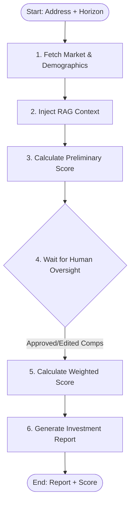

Build a full-stack AI Property Growth Predictor & Investment Analyst called "PropGrowth AI" end to end.

## Project Overview
An AI-powered real estate investment analyst that predicts future property growth potential. It uses Gemini (free tier) for reasoning/generation, LangGraph for state machine orchestration, ChromaDB for grounding (zoning laws, metro expansion, master plans), and incorporates Human-in-the-Loop (HITL) verification to let analysts review comparable properties (Comps) before finalizing reports.

## Tech Stack (Free & Hackathon-Friendly)
- **Backend**: Python 3.11 + FastAPI
- **Agent Orchestrator**: LangGraph
- **LLM**: Google Gemini 2.5 Flash (via free API key from Google AI Studio)
- **RAG / Vector Database**: ChromaDB + free SentenceTransformers (`all-MiniLM-L6-v2`) or Gemini Embeddings
- **Observability**: Langfuse (free tier) or Arize Phoenix
- **Frontend**: React + Vite (HTML5, Vanilla CSS for luxury glassmorphism dark theme)

---

## Step 1: Project Structure
Create this folder structure:
```text
propgrowth/
├── backend/
│   ├── main.py              # FastAPI app & SSE event loop
│   ├── agent.py             # LangGraph state machine & agent workflow
│   ├── tools.py             # Market & Demographics Mock APIs
│   ├── rag.py               # ChromaDB vector index for zoning & infra projects
│   ├── telemetry.py         # Langfuse / Phoenix logging integration
│   ├── data/                # Sample local zoning and development text files
│   │   └── master_plans.txt
│   └── requirements.txt
├── frontend/
│   ├── src/
│   │   ├── App.jsx
│   │   ├── components/
│   │   │   ├── PropertyInput.jsx
│   │   │   ├── HitlVerification.jsx
│   │   │   ├── GrowthScoreRing.jsx
│   │   │   ├── InvestmentReport.jsx
│   │   │   ├── TelemetryMetrics.jsx
│   │   │   └── AgentThinking.jsx
│   │   └── index.css
│   ├── package.json
│   └── vite.config.js
└── .env.example
```

---

## Step 2: Backend - External Tools (tools.py)
Create these tool functions with clean schemas:
1. `get_market_data(address_or_zip)`
   - Returns mock historical sales data, list of 3-4 Comparable Properties ("Comps"), and current median listing price.
2. `get_demographics(zip_code)`
   - Returns population growth rate, local school ratings, and median household income trends.

---

## Step 3: Backend - Grounding & RAG (rag.py)
To protect against hallucinating growth drivers:
- Ingest zoning updates, neighborhood master plans, and upcoming infrastructure projects into a local ChromaDB collection named `zoning_infrastructure`.
- Example data to seed:
  - *"New metro line extension (Line 4) completing in Sector 4 by 2028, adding a station within 500m of Maple St."*
  - *"Zoning rezoned from low-density residential to high-density mixed-use commercial in Zone B-2."*
  - *"Planned tech park 'Silicon East' approved for construction starting Q3 2026."*
- Expose a `query_rag_context(query)` function.

---

## Step 4: Backend - LangGraph State Machine (agent.py)
Implement a state machine with the following nodes:

- Define the Agent State containing inputs, raw comps, demographics, RAG context, preliminary score, user approval status, adjusted comps, and final report.
- Configure a LangGraph `interrupt_before` or manual pause step at the **HITL verification** node.
- The agent halts, returns preliminary results to the frontend, and waits for a user action (`approve` or `modify` comps).

---

## Step 5: Backend - Telemetry & Observability (telemetry.py)
Integrate Langfuse or Phoenix:
- Track trace details for each run.
- Log prompt templates and weights assigned to different growth vectors (e.g., weighing upcoming infrastructure RAG data higher than stagnant historical price vectors).
- Expose `/api/telemetry` endpoint returning trace summaries.

---

## Step 6: Backend - FastAPI App (main.py)
- **POST /api/analyze/start**: Starts the LangGraph execution. Runs nodes 1-3, generates preliminary comps/score, and enters the interrupt state. Returns the current `thread_id` and raw comps.
- **POST /api/analyze/resume**: Resumes the LangGraph workflow with user-approved/modified comps and weights. Runs nodes 5-6 and returns the final report and score.
- **GET /api/analyze/stream/{thread_id}**: Server-Sent Events (SSE) stream showing the active node, transition states, and LLM thoughts.
- **Enable CORS** for frontend local server (`localhost:5173`).

---

## Step 7: Frontend - React & UX (React + Vite)
Create a gorgeous dark glassmorphism interface:
1. **Search Form**: Enter property address/parcel ID & investment horizon (e.g., 5 or 10 years).
2. **SSE Agent Log**: Shows real-time agent progression (e.g., *"Gathering market sales..."* -> *"Searching neighborhood master plans..."*).
3. **HITL Review Dialog**: Displayed when the agent pauses. Shows selected "Comps" with toggle switches to keep/remove them and sliders to adjust weight factors. Clicking "Submit Review" resumes the agent.
4. **Final Investment Report Dashboard**:
   - Dynamic **Future Growth Potential Score** radial gauge.
   - Grounded investment report sections: *Growth Drivers*, *Risk Analysis*, *Financial Projections*.
   - **Telemetry View**: Detailed visualization of LLM inputs, vector database retrievals, and trace logs.

---

## Step 8: Seed Data (data/master_plans.txt)
Write text files describing local development details, zoning rules, and transit plans. Seed this into ChromaDB during backend startup.

---

## Step 9: Setup & Env (.env.example)
```env
GEMINI_API_KEY=your_free_google_ai_studio_api_key
LANGFUSE_PUBLIC_KEY=your_public_key
LANGFUSE_SECRET_KEY=your_secret_key
LANGFUSE_HOST=https://cloud.langfuse.com
PORT=8000
```

---

## Key Hackathon Requirements
- Must use **Gemini 2.5 Flash** (free tier API) and avoid paid model dependencies.
- **LangGraph** must handle the states and HITL interrupt correctly.
- **RAG** must pull zoning/infrastructure constraints from local ChromaDB to ground claims.
- **Observability** dashboard setup (Langfuse or Phoenix) must trace scoring weights.
- **UI** must look like a premium luxury analytics app, using SSE for step-by-step thinking visibility.
